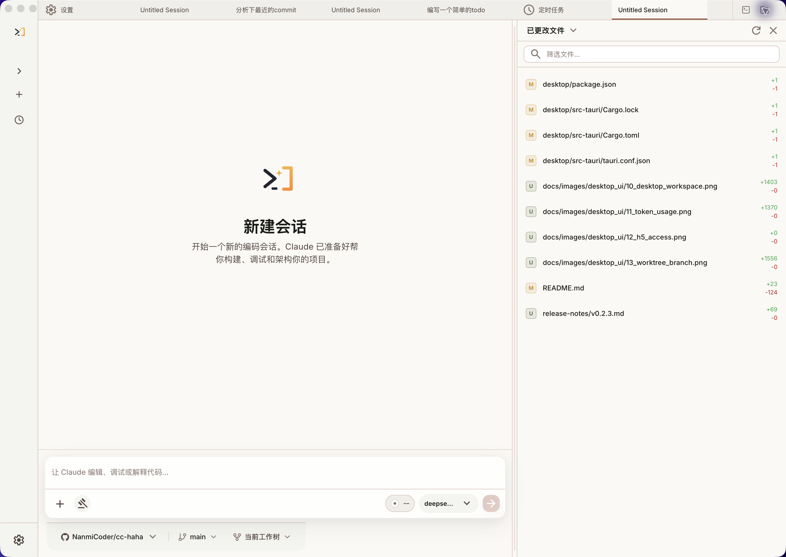

# CC-Tools

<p align="center">
  
</p>

<div align="center">

[](README.md)
[](README.en.md)
[](https://claudecode-haha.relakkesyang.org)

</div>

CC-Tools 是一个面向 Claude Code 的 **桌面端 + CLI + Web 工作台**。项目基于 [NanmiCoder/cc-haha](https://github.com/NanmiCoder/cc-haha) 修改

<p align="center">
  <a href="#桌面端预览">桌面端预览</a> ·
  <a href="#安装桌面端">安装桌面端</a> ·
  <a href="#配置目录说明">配置目录说明</a> ·
  <a href="#web-端说明">Web 端说明</a> ·
  <a href="#更多文档">更多文档</a>
</p>

---

## 桌面端预览

CC-Tools 的桌面端把会话、多项目、分支 / Worktree、右侧代码改动、代码 Diff、权限确认、提供商配置和远程入口集中到一个图形化工作台里，适合不想长期停留在终端里的日常开发工作流。

<p align="center">
  <a href="https://github.com/wenlong66/cc-tools/releases"></a>
  &nbsp;
  <a href="docs/desktop/04-installation.md"></a>
</p>

<table>
  <tr>
    <td align="center" width="25%"><br><b>桌面端工作台</b></td>
    <td align="center" width="25%"><br><b>右侧代码改动 & Worktree</b></td>
    <td align="center" width="25%"><br><b>代码编辑 & Diff 视图</b></td>
    <td align="center" width="25%"><br><b>权限控制 & AI 提问</b></td>
  </tr>
  <tr>
    <td align="center" width="25%"><br><b>H5 远程访问</b></td>
    <td align="center" width="25%"><br><b>Token 用量统计</b></td>
    <td align="center" width="25%"><br><b>Computer Use</b></td>
    <td align="center" width="25%"><br><b>定时任务</b></td>
  </tr>
</table>

---

## 安装桌面端

1. 前往 [Releases](https://github.com/wenlong66/cc-tools/releases) 下载 macOS 或 Windows 桌面端安装包。
2. 首次启动后，在桌面端设置里配置模型提供商、API Key 和默认模型。
3. 如果 macOS 提示应用无法打开，请按 [桌面端安装指南](docs/desktop/04-installation.md) 处理 Gatekeeper 权限。

## 从源码启动 CLI

适合想调试底层 CLI、服务端或自行开发的用户：

```bash
bun install
cp .env.example .env
./bin/cc-tools
```

更多配置见 [环境变量](docs/guide/env-vars.md) 和 [全局使用](docs/guide/global-usage.md)。

---

## 桌面端亮点

- **多会话工作台**：标签页、项目切换、终端入口和会话历史集中管理。
- **分支 / Worktree 启动**：新会话可以选择仓库分支，并决定使用当前工作树还是隔离 Worktree。
- **右侧代码改动面板**：聊天时直接在右侧查看已更改文件、增删行和当前工作区状态。
- **代码修改可视化**：直接查看 AI 对文件的编辑、Diff 和执行过程。
- **权限与确认流**：危险命令、工具调用和 AI 反问可以在桌面端集中审批。
- **多模型提供商**：支持 Anthropic 兼容 API、第三方模型、WebSearch fallback 和本地配置。
- **Computer Use**：让 Agent 在授权后截图、点击、输入并控制桌面应用。
- **H5 远程访问**：用一次性令牌在手机或其他设备上接入当前桌面端会话。
- **IM 接入**：通过 Telegram / 飞书 / 微信 / 钉钉远程对话、切换项目和审批权限。
- **定时任务与用量统计**：在桌面端创建计划任务，并查看本机 Token 使用趋势。

---


## 配置目录说明

CC-Tools 运行时默认使用 **`.cc-tools` 目录**，不是直接读取 Claude 官方的 `~/.claude` 配置目录。

常见配置位置：

- **用户级配置**：`~/.cc-tools/`
- **项目级配置**：`项目根目录/.cc-tools/`
- **常见文件**：
  - `~/.cc-tools/settings.json`
  - `~/.cc-tools/CLAUDE.md`
  - `~/.cc-tools/agents/`
  - `~/.cc-tools/skills/`
  - `项目根目录/.cc-tools/settings.json`
  - `项目根目录/.cc-tools/settings.local.json`
  - `项目根目录/.cc-tools/agents/`
  - `项目根目录/.cc-tools/skills/`

如果你需要自定义全局配置根目录，也可以通过环境变量 `CLAUDE_CONFIG_DIR` 覆盖默认位置。

---

## Web 端说明

仓库中的 [web/](web/) 是一个独立的 Web 前端，主要用于把会话、设置、Provider、MCP、Skills 等能力以浏览器界面展示出来。

简单理解：

- **桌面端**：更适合本机长期使用，能力最完整。
- **Web 端**：更适合做浏览器访问、H5 页面承载和后续远程管理扩展。

本地开发可直接使用：

```bash
# 启动项目服务端
SERVER_PORT=3456 bun run src/server/index.ts

# 启动 Web 前端
cd web
bun install
bun run dev
```

如果你只是普通使用者，优先推荐直接下载桌面端；如果你想二次开发浏览器界面，再关注 `web/` 目录即可。

---

## 更多文档

| 文档 | 说明 |
|------|------|
| [环境变量](docs/guide/env-vars.md) | 完整环境变量参考和配置方式 |
| [第三方模型](docs/guide/third-party-models.md) | 接入 OpenAI / DeepSeek / Ollama 等非 Anthropic 模型 |
| [贡献与质量门禁](docs/guide/contributing.md) | 本地测试、真实模型 baseline、PR 和 release 门禁 |
| [记忆系统](docs/memory/01-usage-guide.md) | 跨会话持久化记忆的使用与实现 |
| [多 Agent 系统](docs/agent/01-usage-guide.md) | 多代理编排、并行任务执行与 Teams 协作 |
| [Skills 系统](docs/skills/01-usage-guide.md) | 可扩展能力插件、自定义工作流与条件激活 |
| [IM 接入](docs/im/) | 通过 Telegram / 飞书 / 微信 / 钉钉远程对话、切换项目和审批权限 |
| [Computer Use](docs/features/computer-use.md) | 桌面控制功能（截屏、鼠标、键盘）— [架构解析](docs/features/computer-use-architecture.md) |
| [桌面端](docs/desktop/) | Tauri 2 + React 图形化客户端 — [快速上手](docs/desktop/01-quick-start.md) \| [架构设计](docs/desktop/02-architecture.md) \| [安装指南](docs/desktop/04-installation.md) |
| [全局使用](docs/guide/global-usage.md) | 在任意目录启动 cc-tools |
| [常见问题](docs/guide/faq.md) | 常见错误排查 |
| [源码修复记录](docs/reference/fixes.md) | 相对于原始泄露源码的修复内容 |
| [项目结构](docs/reference/project-structure.md) | 代码目录结构说明 |

---

## 技术栈

| 类别 | 技术 |
|------|------|
| 语言 | TypeScript |
| 桌面 APP | Tauri 2 |
| 桌面 UI | React + Vite |
| Web UI | React + Vite |
| 本地运行时 | [Bun](https://bun.sh) |
| 终端 UI | React + [Ink](https://github.com/vadimdemedes/ink) |
| CLI 解析 | Commander.js |
| API | Anthropic SDK |
| 协议 | MCP, LSP |

## 感谢

感谢以下开源项目和社区实践为本项目提供参考与启发：

- [React](https://github.com/facebook/react)：前端工程与组件化 UI 生态。
- [Tauri](https://github.com/tauri-apps/tauri)：跨端桌面应用能力与工程实践。
- [cc-switch](https://github.com/farion1231/cc-switch)：模型供应商配置能力参考。
